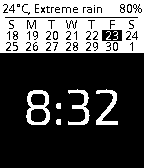

# BLISS TIME 2

    

Version 1.0 released on [apps.getpebble.com](https://apps.getpebble.com/applications/57e354773095e3ed49000004).

* Updated version of [Bliss Time](https://github.com/michaelbreyes/BlissTime) by Michael Reyes to work with SDK 4.
* Watch configuration with [pebble/clay](https://github.com/pebble/clay).
* Added temperature display in deg C, deg F and K.
* Removed time in text format.

Version 2.0 released

* Added stock display.

Version 2.22

* User supplied OWM API Key.

Version 3.13

* Added analog clock face.

Version 3.15

* Support for Timeline Quick View

Version 3.16

* Show second hand for 30 seconds by tapping screen or shaking watch.

Version 3.31

* Added some colours.
* _Should_ launch faster.

